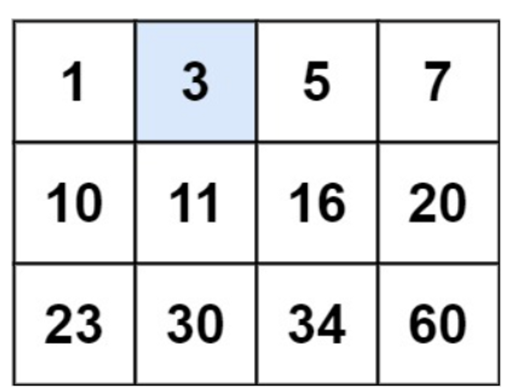
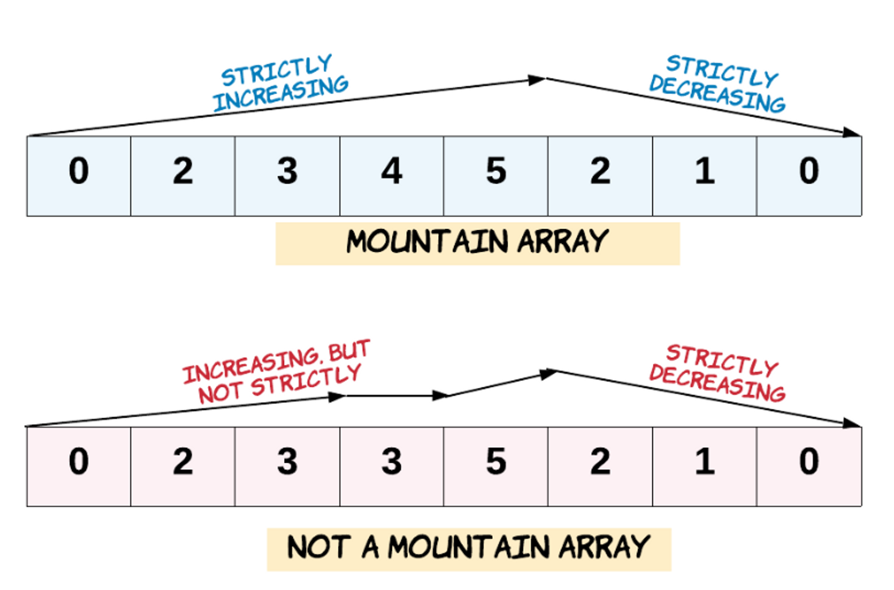
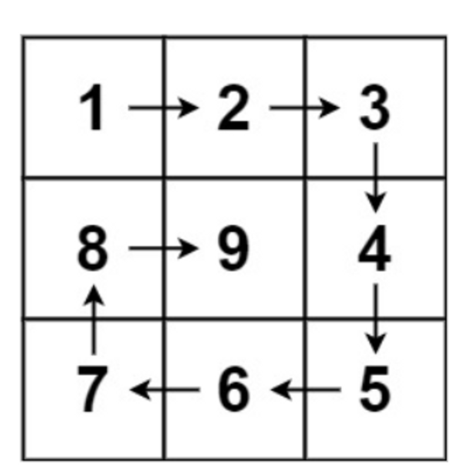
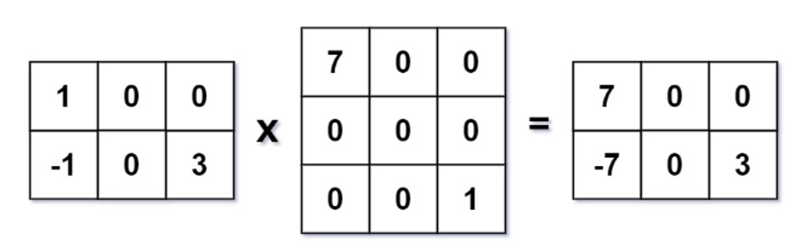

Q1. A permutation perm of n + 1 integers of all the integers in the range [0, n] can be represented as a string s of length n where:

- s[i] == 'I' if perm[i] < perm[i + 1], and
- s[i] == 'D' if perm[i] > perm[i + 1].

Given a string s, reconstruct the permutation perm and return it. If there are multiple valid permutations perm, return **any of them**.

**Example 1:**

**Input:** s = "IDID"

**Output:**

[0,4,1,3,2]

**Solution1:**

```javascript
function reconstructPermutation(s) {
	const n = s.length;
	const perm = new Array(n + 1);
	let left = 0;
	let right = n;

	for (let i = 0; i < n; i++) {
		if (s[i] === "I") {
			perm[i] = left;
			left++;
		} else if (s[i] === "D") {
			perm[i] = right;
			right--;
		}
	}

	perm[n] = left;
	return perm;
}

const s = "IDID";
const perm = reconstructPermutation(s);
console.log(perm);

// [0, 4, 1, 3, 2]
```

---

Q2. You are given an m x n integer matrix matrix with the following two properties:

- Each row is sorted in non-decreasing order.
- The first integer of each row is greater than the last integer of the previous row.

Given an integer target, return true _if_ target _is in_ matrix _or_ false _otherwise_.

You must write a solution in O(log(m \* n)) time complexity.

**Example 1:**



**Input:** matrix = [[1,3,5,7],[10,11,16,20],[23,30,34,60]], target = 3

**Output:** true

**Solution2:**

```javascript
function searchMatrix(matrix, target) {
	if (matrix.length === 0 || matrix[0].length === 0) {
		return false;
	}

	const rows = matrix.length;
	const cols = matrix[0].length;
	let left = 0;
	let right = rows * cols - 1;

	while (left <= right) {
		const mid = Math.floor((left + right) / 2);
		const midElement = matrix[Math.floor(mid / cols)][mid % cols];

		if (midElement === target) {
			return true;
		} else if (midElement < target) {
			left = mid + 1;
		} else {
			right = mid - 1;
		}
	}

	return false;
}

// Test the function
const matrix = [
	[1, 3, 5, 7],
	[10, 11, 16, 20],
	[23, 30, 34, 60],
];
const target = 3;
const found = searchMatrix(matrix, target);
console.log(found);

// Output -> true
```

---

Q3. Given an array of integers arr, return _true if and only if it is a valid mountain array_.

Recall that arr is a mountain array if and only if:

- arr.length >= 3
- There exists some i with 0 < i < arr.length - 1 such that:
  - arr[0] < arr[1] < ... < arr[i - 1] < arr[i]
  - arr[i] > arr[i + 1] > ... > arr[arr.length - 1]



**Example 1:**

**Input:** arr = [2,1]

**Output:**

false

**Solution3:**

```javascript
function validMountainArray(arr) {
	if (arr.length < 3) {
		return false;
	}

	let i = 0;
	const n = arr.length;

	// Step 1: Find the peak
	while (i < n - 1 && arr[i] < arr[i + 1]) {
		i++;
	}

	// Check if peak is at either end or not found
	if (i === 0 || i === n - 1) {
		return false;
	}

	// Step 2: Check descending order
	while (i < n - 1 && arr[i] > arr[i + 1]) {
		i++;
	}

	return i === n - 1;
}

// Example usage:
const arr = [2, 1];
const isValidMountain = validMountainArray(arr);
console.log(isValidMountain); // Output: false
```

---

Q4. Given a binary array nums, return _the maximum length of a contiguous subarray with an equal number of_ 0 _and_ 1.

**Example 1:**

**Input:** nums = [0,1]

**Output:** 2

**Explanation:**

[0, 1] is the longest contiguous subarray with an equal number of 0 and 1.

**Solution4:**

```javascript
function findMaxLength(nums) {
	let count = 0; // Count of 0's and 1's
	let maxLength = 0; // Maximum length of a subarray with equal 0's and 1's

	// Create a map to store the count at each encountered prefix sum
	const countMap = new Map();
	countMap.set(0, -1); // Initialize the map with prefix sum 0 at index -1

	for (let i = 0; i < nums.length; i++) {
		// Increment the count by 1 if nums[i] is 1, otherwise decrement by 1
		count += nums[i] === 1 ? 1 : -1;

		if (countMap.has(count)) {
			// If the current count is already in the map,
			// calculate the length of the subarray and update maxLength if necessary
			maxLength = Math.max(maxLength, i - countMap.get(count));
		} else {
			// If the current count is not in the map, add it with the current index
			countMap.set(count, i);
		}
	}
	return maxLength;
}

const nums = [0, 1];
const maxLength = findMaxLength(nums);
console.log(maxLength);

// output -> 2
```

---

Q5. The **product sum** of two equal-length arrays a and b is equal to the sum of a[i] \* b[i] for all 0 <= i < a.length (**0-indexed**).

- For example, if a = [1,2,3,4] and b = [5,2,3,1], the **product sum** would be 1*5 + 2*2 + 3*3 + 4*1 = 22.

Given two arrays nums1 and nums2 of length n, return _the **minimum product sum** if you are allowed to **rearrange** the **order** of the elements in_ nums1.

**Example 1:**

**Input:** nums1 = [5,3,4,2], nums2 = [4,2,2,5]

**Output:** 40

**Explanation:**

We can rearrange nums1 to become [3,5,4,2]. The product sum of [3,5,4,2] and [4,2,2,5] is 3*4 + 5*2 + 4*2 + 2*5 = 40.

**Solution5:**

```javascript
function minProductSum(nums1, nums2) {
	nums1.sort((a, b) => a - b); // Sort nums1 in ascending order
	nums2.sort((a, b) => b - a); // Sort nums2 in descending order

	let productSum = 0;
	for (let i = 0; i < nums1.length; i++) {
		productSum += nums1[i] * nums2[i];
	}

	return productSum;
}

const nums1 = [5, 3, 4, 2];
const nums2 = [4, 2, 2, 5];
const output = minProductSum(nums1, nums2);
console.log(output);

//Output -> 40
```

---

Q6. An integer array original is transformed into a **doubled** array changed by appending **twice the value** of every element in original, and then randomly **shuffling** the resulting array.

Given an array changed, return original _if_ changed _is a **doubled** array. If_ changed _is not a **doubled** array, return an empty array. The elements in_ original _may be returned in **any** order_.

**Example 1:**

**Input:** changed = [1,3,4,2,6,8]

**Output:** [1,3,4]

**Explanation:** One possible original array could be [1,3,4]:

- Twice the value of 1 is 1 \* 2 = 2.
- Twice the value of 3 is 3 \* 2 = 6.
- Twice the value of 4 is 4 \* 2 = 8.

Other original arrays could be [4,3,1] or [3,1,4].

**Solution6:**

```javascript
function findOriginalArray(changed) {
	// Check if the length of changed is odd or if it's an empty array
	if (changed.length % 2 !== 0 || changed.length === 0) {
		return [];
	}

	// Create a map to count the occurrences of each number in changed
	const countMap = new Map();
	for (let num of changed) {
		countMap.set(num, (countMap.get(num) || 0) + 1);
	}

	// Sort the changed array in ascending order
	changed.sort((a, b) => a - b);

	// Iterate through the sorted changed array
	const original = [];
	for (let num of changed) {
		// If the current number has already been used up, skip it
		if (countMap.get(num) === 0) {
			continue;
		}

		// Check if the double of the current number is present in changed
		const double = num * 2;
		if (!countMap.has(double) || countMap.get(double) === 0) {
			return [];
		}

		// Add the current number to the original array
		original.push(num);

		// Update the counts in the map
		countMap.set(num, countMap.get(num) - 1);
		countMap.set(double, countMap.get(double) - 1);
	}

	return original;
}

const changed = [1, 3, 4, 2, 6, 8];
const original = findOriginalArray(changed);
console.log(original);

// output [1,3,4]
```

---

Q7. Given a positive integer n, generate an n x n matrix filled with elements from 1 to n2 in spiral order.

**Example 1:**


**Input:** n = 3

**Output:** [[1,2,3],[8,9,4],[7,6,5]]

**Solution:**

```javascript
function generateMatrix(n) {
	// Create an empty matrix filled with zeros
	const matrix = Array(n)
		.fill()
		.map(() => Array(n).fill(0));

	let num = 1; // Current number to fill in the matrix
	let rowStart = 0; // Starting index of the current row
	let rowEnd = n - 1; // Ending index of the current row
	let colStart = 0; // Starting index of the current column
	let colEnd = n - 1; // Ending index of the current column

	while (num <= n * n) {
		// Fill the top row from left to right
		for (let i = colStart; i <= colEnd; i++) {
			matrix[rowStart][i] = num;
			num++;
		}
		rowStart++;

		// Fill the right column from top to bottom
		for (let i = rowStart; i <= rowEnd; i++) {
			matrix[i][colEnd] = num;
			num++;
		}
		colEnd--;

		// Fill the bottom row from right to left
		for (let i = colEnd; i >= colStart; i--) {
			matrix[rowEnd][i] = num;
			num++;
		}
		rowEnd--;

		// Fill the left column from bottom to top
		for (let i = rowEnd; i >= rowStart; i--) {
			matrix[i][colStart] = num;
			num++;
		}
		colStart++;
	}

	return matrix;
}

// Test the function
const n = 3;
const spiralMatrix = generateMatrix(n);
console.log(spiralMatrix);

// [[1, 2, 3], [8, 9, 4], [7, 6, 5]]
```

---

Q8. Given two [sparse matrices](https://en.wikipedia.org/wiki/Sparse_matrix) mat1 of size m x k and mat2 of size k x n, return the result of mat1 x mat2. You may assume that multiplication is always possible.

**Example 1:**



**Input:** mat1 = [[1,0,0],[-1,0,3]], mat2 = [[7,0,0],[0,0,0],[0,0,1]]

**Output:**

[[7,0,0],[-7,0,3]]

**Solution 8:**

```javascript
function multiplySparseMatrices(mat1, mat2) {
	const m = mat1.length; // Number of rows in mat1
	const k = mat1[0].length; // Number of columns in mat1
	const n = mat2[0].length; // Number of columns in mat2

	// Initialize the resulting matrix with zeros
	const result = Array.from({ length: m }, () => Array(n).fill(0));

	// Create a transpose of mat2 for efficient column access
	const mat2Transpose = [];
	for (let j = 0; j < n; j++) {
		mat2Transpose[j] = [];
		for (let i = 0; i < k; i++) {
			mat2Transpose[j][i] = mat2[i][j];
		}
	}

	// Perform sparse matrix multiplication
	for (let i = 0; i < m; i++) {
		for (let j = 0; j < n; j++) {
			let sum = 0;

			// Multiply non-zero elements of mat1 and mat2Transpose
			for (let p = 0; p < k; p++) {
				if (mat1[i][p] !== 0 && mat2Transpose[j][p] !== 0) {
					sum += mat1[i][p] * mat2Transpose[j][p];
				}
			}

			result[i][j] = sum;
		}
	}

	return result;
}

// Example input
const mat1 = [
	[1, 0, 0],
	[-1, 0, 3],
];
const mat2 = [
	[7, 0, 0],
	[0, 0, 0],
	[0, 0, 1],
];

// Call the function and print the result
const result = multiplySparseMatrices(mat1, mat2);
console.log(result);

// Output -> [ [7, 0, 0], [-7, 0, 3] ]
```

---
